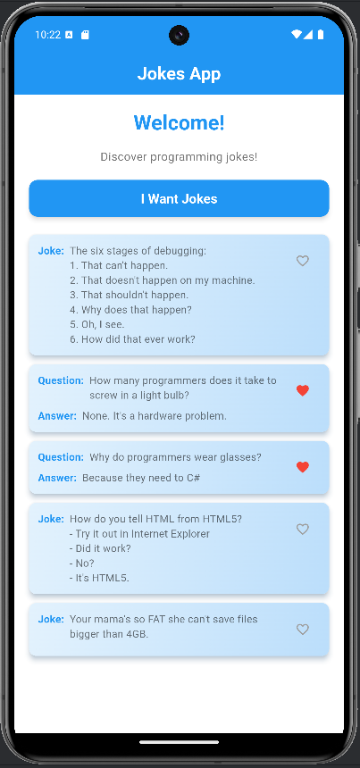

# Jokes App 🎉
A simple Flutter application that displays programming jokes fetched from an API, complete with a like feature for each joke.

---

## Features
- Fetches programming jokes from [JokeAPI](https://v2.jokeapi.dev).
- Supports "single" and "Q&A" joke formats.
- Allows users to "like" jokes with a heart icon.
- Caches jokes locally using `shared_preferences`.
- Responsive design with a clean UI.

---

## Getting Started

### Prerequisites
Ensure you have the following installed:
1. **Flutter SDK** (version 3.0 or higher)
    - Installation Guide: [Flutter Install](https://flutter.dev/docs/get-started/install)
2. **Dart SDK**
3. **Android Studio** (for Android development) or **Xcode** (for iOS development).
4. **Git**

---

## Setup Instructions

### 1. Clone the Repository
```bash
git clone <your-repo-url>
cd jokes_app
```

### 2. Install Dependencies
Run the following command to install all required packages:
```bash
flutter pub get
```

### 3. Configure the Project

- Ensure the `pubspec.yaml` includes the necessary dependencies:
  ```yaml
  dependencies:
    flutter:
      sdk: flutter
    dio: ^5.0.0
    shared_preferences: ^2.0.15
    flutter_svg: ^1.1.6
  ```
- All required packages are already in the `pubspec.yaml` file of the repository.

### 4. API Configuration
This app uses **JokeAPI**. No additional configuration is needed as the base URL and query parameters are predefined in the `joke_service.dart` file:
```dart
final String baseUrl = 'https://v2.jokeapi.dev/joke';
```

### 5. Run the App
To run the app, use the following command:
```bash
flutter run
```

---

## File Structure

```plaintext
lib/
├── cache.dart              
├── joke_card.dart           
├── joke_service.dart        
├── main.dart               
├── pages/
│   └── home.dart            
```

---

## Screenshots

### Home Screen




---

## Dependencies

- **Dio**: For HTTP requests.
- **SharedPreferences**: For local data caching.
- **Flutter SVG**: For vector-based icons.

---

## Running on a Device

### Android
1. Ensure an emulator or physical device is connected.
2. Run:
   ```bash
   flutter run
   ```

### iOS
1. Open the project in Xcode.
2. Ensure a simulator or physical device is connected.
3. Run:
   ```bash
   flutter run
   ```

---

## Contribution
Feel free to fork and submit PRs for improvements or additional features.

---
